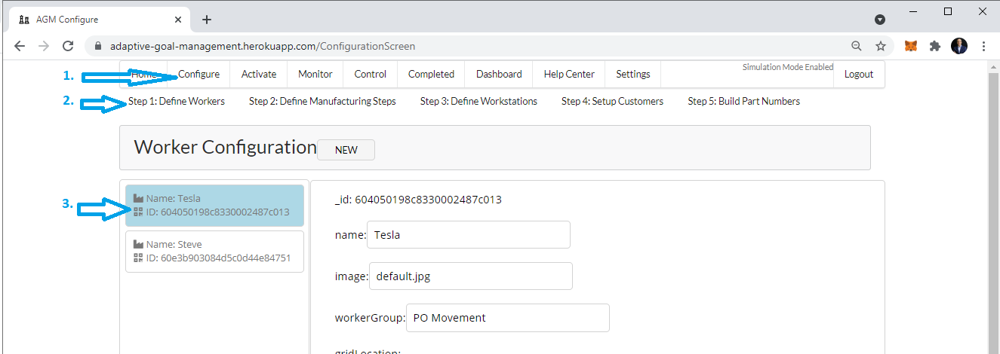
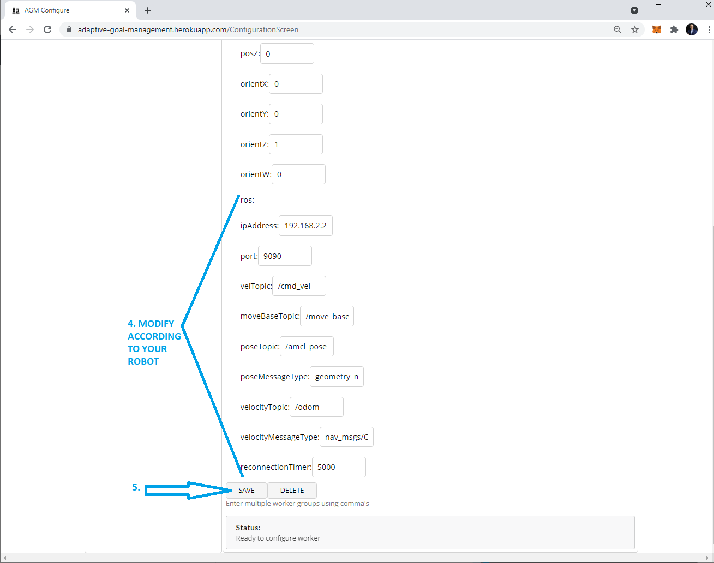

# ROS Worker Control #

The platform includes the ability to control a ROS based robot using a joystick in the browser and navigation by setting goals from a map visualized in the browser.  Below is a picture of the screen with a description of the key components.

- SELECTED ROBOT: You can have multiple robots connected in this platform in your account.  You select the robot you would like to control by clicking on it.
- CONNECTION STATUS: This shows you the status of the connection to the robot.  If it is not connected it will prompt you to click on this alert to try to connect again.
- JOYSTICK: This allows you to move your robot using a joystick like control.
- MAP: This is the map which the robot is using to navigate.  It is the map published on the ros `/map` topic.  The topic can be configured if your robot has it published on a different topic.
- LOCATION ON MAP: This icon shows the current location of the robot.
- CURRENT POSITION: This shows the coordinates in the map world of the robot in meters.
- CURRENT VELOCITY: This shows the velocity components of the robot in meters per second.

### Navigation ###
You can send goals to your robot by clicking on the map.  This will trigger the robot to navigate to the specified location.

## Setting up Robot ##
In order for your ROS robot to use this control screen you will need to have the following configured:
- rosbridge server using secure websocket secure protocol (wss)
- generate and point websocket launch files to ssl (secure sockets layer) certificate cert and pem files located on your robot
- run a robot pose publisher

Below is a list of the key commands.  In a YouTube video I will walk you through how to setup and run all the key components.

## Components and launch files ##
- clone the following repositiory into your `catkin_ws/src directory` and run 'catkin_make': https://github.com/mukmalone/agm_robot_pose_publisher
- generate the `.key` and `.cert` files using the following instructions:
> - openssl genrsa -out server.key 2048
> - openssl rsa -in server.key -out server.key
> - openssl req -sha256 -new -key server.key -out server.csr -subj '/CN=localhost'
> > - replace 'localhost' with the url you are using which normally is the ipaddress:port.  For example: `192.168.2.27:9090`
> - openssl x509 -req -sha256 -days 365 -in server.csr -signkey server.key -out server.crt
- install the ros package [rosbridge_suite](http://wiki.ros.org/rosbridge_suite#:~:text=At%20its%20core%2C%20rosbridge%20is,and%20handling%20for%20specific%20datatypes.)
- configure the file `rosbridge_websocket_ssl.launch` located in `agm_robot_pose_publisher/launch` directory.
> - line 2: port you will use for websocket
> - line 3: ipaddress of the robot
> - line 4: ssl set to `true`
> - line 5: location and name of the `.crt` file
> - line 6: location and name of the `.key` file

## Running everything ##
- Launch your robot with Navigation
- `roslaunch agm_robot_pose_publisher rosbridge_websocket_ssl.launch`
- `rosrun agm_robot_pose_publisher agm_robot_pose_publisher`

## Setting up AGM ##

Scroll down the screen

